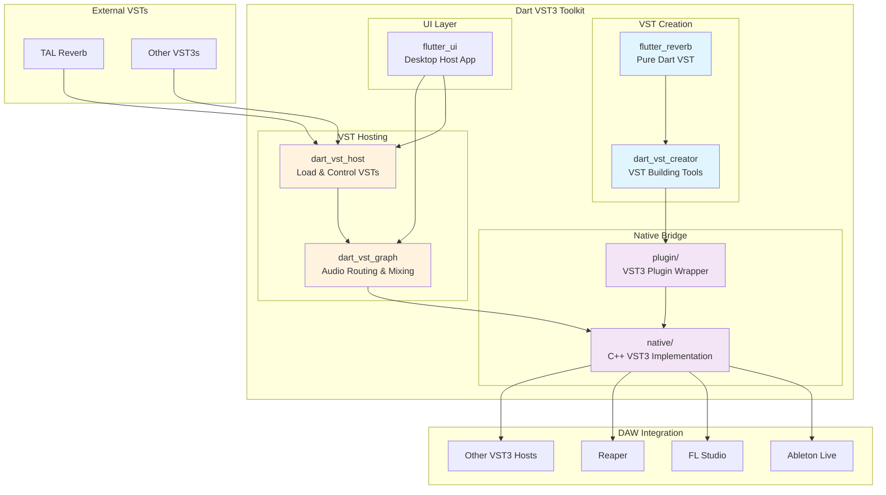
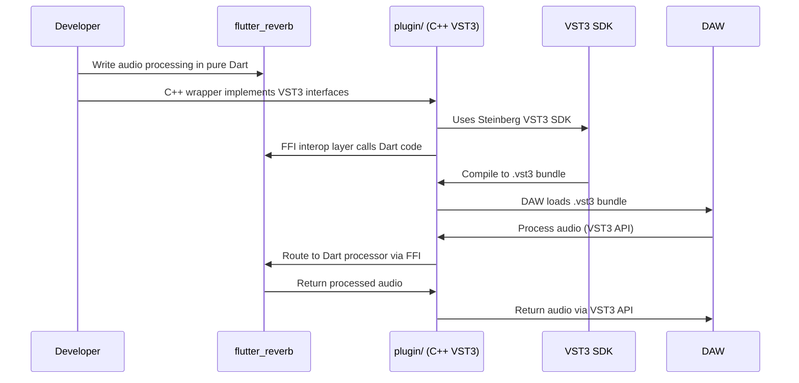
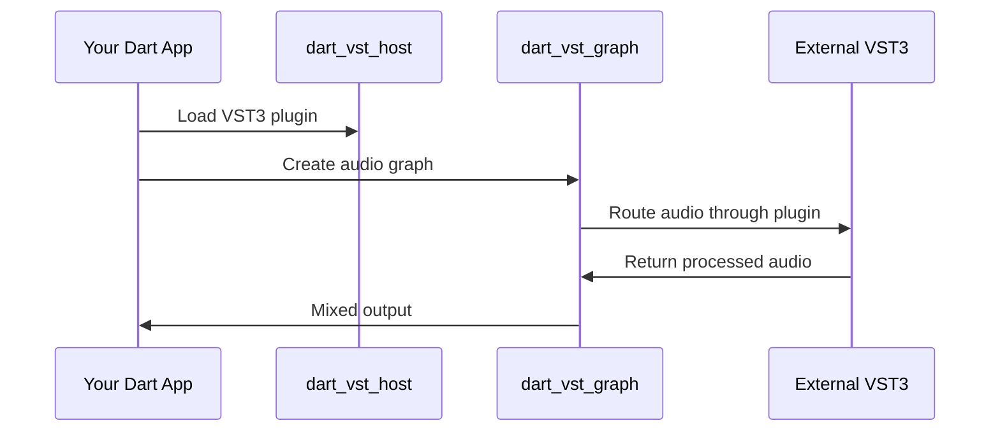
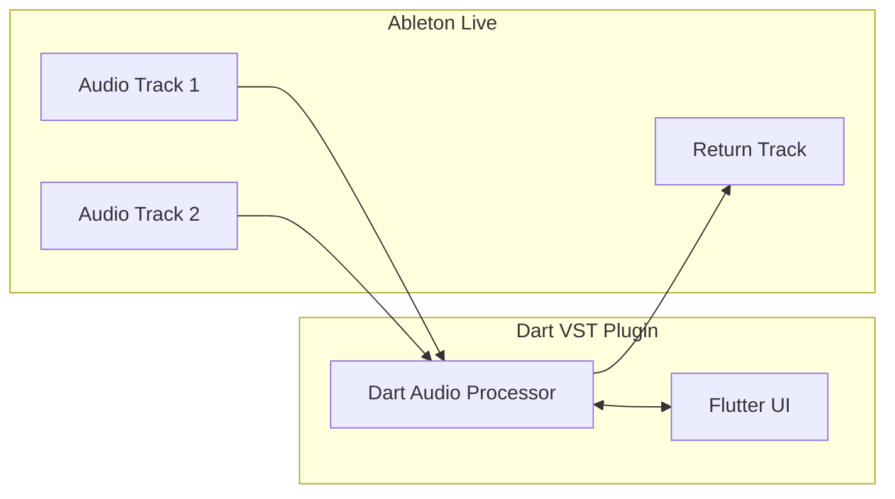
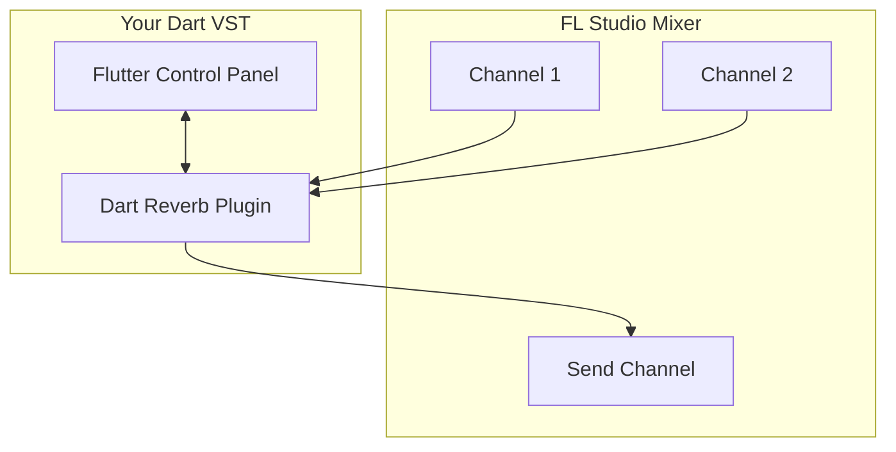

# Dart VST3 Toolkit

**A comprehensive toolkit for building VST3 plugins and hosts in pure Dart and Flutter.**

This is first and foremost a toolkit for creating VST3 plugins and VST hosts using Dart and Flutter. The toolkit enables developers to build professional audio plugins with modern UI frameworks while leveraging the power of the VST3 ecosystem.

## Architecture Overview



## Package Overview

### 🎛️ VST3 Plugin Creation

**Primary Purpose: Build actual VST3 plugins using Dart/Flutter that compile to .vst3 bundles**

- **`flutter_reverb`** - Complete VST3 reverb plugin implementation in pure Dart, compiles via existing C++/VST3 SDK infrastructure to actual .vst3 bundle
- **`plugin/`** - C++ VST3 wrapper using Steinberg SDK that hosts Dart code via FFI interop layer
- **`native/`** - C++ infrastructure providing the bridge between VST3 API and Dart audio processing

### 🎧 VST Hosting Packages  

**Primary Purpose: Load and control existing VST3 plugins from Dart applications**

- **`dart_vst_host`** - High-level API for loading and controlling VST3 plugins
- **`dart_vst_graph`** - Audio graph system for routing and mixing VST plugins with built-in nodes (mixers, splitters, gain)

### 🔧 Native Infrastructure

- **`native/`** - C++ implementation using Steinberg VST3 SDK
- **`plugin/`** - VST3 plugin wrapper that hosts the Dart audio graph
- **`flutter_ui/`** - Desktop Flutter application for interactive testing

## Use Cases

### 1. Creating VST3 Plugins in Dart/Flutter



### 2. Building VST Host Applications



### 3. DAW Integration Examples

#### Ableton Live Workflow


#### FL Studio Integration  


## Quick Start

### Prerequisites

```bash
# Set VST3 SDK path
export VST3_SDK_DIR=/path/to/vst3sdk

# Install dependencies
flutter pub get
dart pub get
```

### Building Your First VST Plugin

1. **Study the reference implementation:**
```bash
cd flutter_reverb/
flutter run example/demo.dart
```

2. **Build the native infrastructure:**
```bash
cd native/
mkdir build && cd build
cmake ..
make
```

3. **Create VST3 bundle:**
```bash
cd plugin/
mkdir build && cd build  
cmake ..
make
# Output: your_plugin.vst3
```

### Building a VST Host Application

```dart
import 'package:dart_vst_host/dart_vst_host.dart';
import 'package:dart_vst_graph/dart_vst_graph.dart';

void main() async {
  // Initialize host
  final host = VstHost();
  await host.initialize();
  
  // Load VST plugin
  final plugin = await host.loadPlugin('path/to/plugin.vst3');
  
  // Create audio graph
  final graph = VstGraph();
  final pluginNode = graph.addVstNode(plugin);
  final mixerNode = graph.addMixerNode();
  
  // Connect nodes
  graph.connect(pluginNode.output, mixerNode.input1);
  
  // Start processing
  await graph.start();
}
```

## Project Structure

```
dart_vst_toolkit/
├── flutter_reverb/         # Reference VST implementation  
├── dart_vst_host/          # VST hosting API
├── dart_vst_graph/         # Audio graph system
├── native/                 # C++ VST3 implementation
├── plugin/                 # VST3 plugin wrapper
├── flutter_ui/             # GUI host application
└── vst_plugins/            # External VST3 plugins for testing
```

## Development Workflow

### 1. VST Plugin Development
1. Implement audio processing in `flutter_reverb/lib/src/reverb_processor.dart`
2. Design UI in `flutter_reverb/lib/src/reverb_ui.dart`  
3. Test with Flutter: `flutter run`
4. Build VST3: `make -C plugin/build`
5. Test in DAW

### 2. Host Application Development
1. Build native library: `make -C native/build`
2. Implement in Dart using `dart_vst_host` and `dart_vst_graph`
3. Test with Flutter UI: `flutter run -d desktop`

## Testing

**All packages:**
```bash
# Build native dependencies first
cd native/ && mkdir build && cd build && cmake .. && make

# Test Dart packages
cd dart_vst_host/ && dart test
cd dart_vst_graph/ && dart test
cd flutter_reverb/ && dart test
```

**Integration testing:**
```bash
cd flutter_ui/
flutter run  # Interactive testing with GUI
```

## Key Features

### For VST Plugin Creators
- ✅ Pure Dart/Flutter audio processing
- ✅ Modern Flutter UI framework
- ✅ Hot reload during development
- ✅ Cross-platform VST3 output
- ✅ Parameter automation
- ✅ State persistence

### For VST Host Developers  
- ✅ Load any VST3 plugin
- ✅ Flexible audio routing
- ✅ Built-in mixing nodes
- ✅ Real-time parameter control
- ✅ RAII resource management
- ✅ Flutter UI integration

### Platform Support
- ✅ **macOS**: `.dylib` + `.vst3` bundle
- ✅ **Linux**: `.so` library
- ✅ **Windows**: `.dll` library *(coming soon)*

## Examples in the Wild

### Creating Reverb VST
```dart
// flutter_reverb/lib/src/reverb_processor.dart
class ReverbProcessor {
  void processStereo(List<double> inputL, List<double> inputR,
                    List<double> outputL, List<double> outputR) {
    // Your reverb algorithm here
    for (int i = 0; i < inputL.length; i++) {
      outputL[i] = inputL[i] * wetLevel + reverbL * dryLevel;
      outputR[i] = inputR[i] * wetLevel + reverbR * dryLevel;
    }
  }
}
```

### Loading VSTs in Your App
```dart
// Using dart_vst_host
final plugin = await host.loadPlugin('/path/to/TAL-Reverb-4.vst3');
plugin.setParameter(0, 0.75); // Set room size
final processedAudio = plugin.processAudio(inputBuffer);
```

### Building Audio Graphs
```dart  
// Using dart_vst_graph
final graph = VstGraph();
final reverb = graph.addVstNode(reverbPlugin);
final delay = graph.addVstNode(delayPlugin);
final mixer = graph.addMixerNode();

// Chain: input -> reverb -> delay -> mixer -> output
graph.connect(graph.input, reverb.input);
graph.connect(reverb.output, delay.input);
graph.connect(delay.output, mixer.input1);
graph.connect(mixer.output, graph.output);
```

## Contributing

This toolkit is designed for professional audio development. Contributions should maintain:

- **No duplication**: Use existing components, don't recreate them
- **No placeholders**: Implementation must be complete and functional  
- **Pure FP style**: Immutable data, pure functions
- **Comprehensive testing**: Tests must fail hard, no warnings
- **Clear documentation**: All public APIs documented

## License

This project uses the Steinberg VST3 SDK. Please review the VST3 License Agreement before commercial use.

---

**Ready to build the next generation of audio plugins with Dart and Flutter? Start with `flutter_reverb` and explore the examples!**