# Dart VST3 Toolkit

**A comprehensive toolkit for building VST3 plugins and hosts in pure Dart and Flutter.**

This is first and foremost a toolkit for creating VST3 plugins and VST hosts using Dart and Flutter. The toolkit enables developers to build professional audio plugins with modern UI frameworks while leveraging the power of the VST3 ecosystem.

## Architecture Overview

### VST3 Plugin Architecture with Native Dart Executable

The toolkit uses a unique architecture where Dart code is compiled to **native machine code executables** that communicate with the VST3 wrapper via IPC (Inter-Process Communication). This provides true native performance without requiring the Dart runtime in the DAW.


### Native Executable Implementation


## Package Overview

### 🎛️ VST3 Plugin Creation

**Primary Purpose: Build actual VST3 plugins using Dart/Flutter that compile to .vst3 bundles**

- **`dart_vst3_bridge`** - Auto-generates all C++ VST3 boilerplate from Dart parameter definitions
- **`vsts/flutter_reverb`** - Complete VST3 reverb plugin implementation in pure Dart  
- **`vsts/echo`** - VST3 echo/delay plugin implementation in pure Dart
- **Native Executable Compilation** - Dart code compiles to native machine code executables (no runtime required)

### 🎧 VST Hosting Packages  

**Primary Purpose: Load and control existing VST3 plugins from Dart applications**

- **`dart_vst_host`** - High-level API for loading and controlling VST3 plugins
- **`dart_vst_graph`** - Audio graph system for routing and mixing VST plugins with built-in nodes (mixers, splitters, gain)

### 🔧 Native Infrastructure

- **`native/`** - C++ implementation using Steinberg VST3 SDK
- **`plugin/`** - VST3 plugin wrapper that hosts the Dart audio graph
- **`flutter_ui/`** - Desktop Flutter application for interactive testing

## Use Cases

### 1. Creating VST3 Plugins in Dart/Flutter  

```mermaid
sequenceDiagram
    participant Dev as Developer
    participant Dart as Dart Plugin Code
    participant CMake as CMake Build
    participant EXE as Native Executable
    participant VST3 as VST3 Wrapper
    participant DAW as DAW

    Dev->>Dart: Write audio processing in pure Dart
    Dev->>CMake: Run build (make reverb-vst)
    CMake->>EXE: dart compile exe → native binary
    CMake->>VST3: Generate C++ wrapper code
    CMake->>VST3: Bundle executable + wrapper
    DAW->>VST3: Load .vst3 plugin
    VST3->>EXE: Spawn Dart process
    DAW->>VST3: Process audio buffer
    VST3->>EXE: Send via binary IPC
    EXE->>VST3: Return processed audio
    VST3->>DAW: Output to DAW
```



**Key Benefits:**
- ✅ **Zero Dart Runtime** - Compiles to native machine code
- ✅ **Process Isolation** - Plugin crashes won't affect DAW
- ✅ **Cross-Platform** - Works on Windows/macOS/Linux  
- ✅ **Small Binary Size** - No VM or runtime overhead
- ✅ **Auto-Generated C++** - CMake generates all VST3 boilerplate from Dart

### 2. Building VST Host Applications


### 3. DAW Integration Examples

#### Ableton Live Workflow


#### FL Studio Integration  


## Quick Start

### Prerequisites

```bash
# Set VST3 SDK path
export VST3_SDK_DIR=/path/to/vst3sdk

# Install dependencies
flutter pub get
dart pub get
```

### Building Your First VST Plugin

1. **Study the reference implementations:**
```bash
# Flutter Reverb plugin
cd vsts/flutter_reverb/
dart run example/demo.dart

# Echo plugin  
cd vsts/echo/
dart run example/demo.dart
```

2. **Build using the Makefile:**
```bash
# Build the Flutter Reverb VST3 (default)
make

# Build specific plugins:
make reverb-vst       # Build flutter_reverb.vst3
make echo-vst         # Build echo.vst3

# Install to system VST folder
make install
```

The build process automatically:
1. Compiles your Dart code to a native executable (`dart compile exe`)
2. Generates all C++ VST3 wrapper code from your Dart parameter definitions
3. Bundles everything into a .vst3 plugin ready for any DAW

### Creating Your Own VST Plugin

1. **Define your parameters with doc comments:**
```dart
// lib/src/my_parameters.dart
class MyParameters {
  /// Controls the output volume (0% = silence, 100% = full volume)
  double gain = 0.5;
  
  /// Adds warmth to the signal (0% = clean, 100% = saturated)
  double warmth = 0.0;
}
```

2. **Create your processor:**
```dart
// lib/src/my_processor.dart
class MyProcessor {
  void processStereo(List<double> inputL, List<double> inputR,
                    List<double> outputL, List<double> outputR,
                    MyParameters params) {
    for (int i = 0; i < inputL.length; i++) {
      outputL[i] = inputL[i] * params.gain;
      outputR[i] = inputR[i] * params.gain;
    }
  }
}
```

3. **Create the executable entry point:**
```dart
// lib/my_plugin_processor_exe.dart
import 'dart:io';
import 'dart:typed_data';
import 'src/my_processor.dart';
import 'src/my_parameters.dart';

void main() async {
  final processor = MyProcessor();
  final parameters = MyParameters();
  
  // Binary IPC protocol implementation
  // (See echo_processor_exe.dart for full example)
}
```

4. **CMake automatically generates everything else!**

### Building a VST Host Application

```dart
import 'package:dart_vst_host/dart_vst_host.dart';
import 'package:dart_vst_graph/dart_vst_graph.dart';

void main() async {
  // Initialize host
  final host = VstHost();
  await host.initialize();
  
  // Load VST plugin (including your Dart VSTs!)
  final plugin = await host.loadPlugin('FlutterDartReverb.vst3');
  
  // Create audio graph
  final graph = VstGraph();
  final pluginNode = graph.addVstNode(plugin);
  final mixerNode = graph.addMixerNode();
  
  // Connect nodes
  graph.connect(pluginNode.output, mixerNode.input1);
  
  // Start processing
  await graph.start();
}
```

## Project Structure

```
dart_vst3_toolkit/
├── dart_vst3_bridge/       # Generic FFI bridge for ANY Dart VST3 plugin
├── flutter_reverb/         # Example reverb VST3 implementation (uses bridge)
├── dart_vst_host/          # VST3 hosting API for Dart applications
├── dart_vst_graph/         # Audio graph system with VST routing
├── native/                 # C++ VST3 SDK integration + FFI bridge
├── plugin/                 # VST3 plugin wrapper (compiles Dart to .vst3)
├── flutter_ui/             # GUI host application
└── vst_plugins/            # External VST3 plugins for testing
```

## Development Workflow

### 1. VST Plugin Development
1. Implement audio processing in `flutter_reverb/lib/src/reverb_processor.dart`
2. Design UI in `flutter_reverb/lib/src/reverb_ui.dart`  
3. Test with Flutter: `flutter run`
4. Build VST3: `make -C plugin/build`
5. Test in DAW

### 2. Host Application Development
1. Build native library: `make -C native/build`
2. Implement in Dart using `dart_vst_host` and `dart_vst_graph`
3. Test with Flutter UI: `flutter run -d desktop`

## Testing

**All packages:**
```bash
# Build native dependencies first
cd native/ && mkdir build && cd build && cmake .. && make

# Test Dart packages
cd dart_vst_host/ && dart test
cd dart_vst_graph/ && dart test
cd flutter_reverb/ && dart test
```

**Integration testing:**
```bash
cd flutter_ui/
flutter run  # Interactive testing with GUI
```

## Key Features

### For VST Plugin Creators
- ✅ Pure Dart/Flutter audio processing
- ✅ Modern Flutter UI framework
- ✅ Hot reload during development
- ✅ Cross-platform VST3 output
- ✅ Parameter automation
- ✅ State persistence

### For VST Host Developers  
- ✅ Load any VST3 plugin
- ✅ Flexible audio routing
- ✅ Built-in mixing nodes
- ✅ Real-time parameter control
- ✅ RAII resource management
- ✅ Flutter UI integration

### Platform Support
- ✅ **macOS**: `.dylib` + `.vst3` bundle
- ✅ **Linux**: `.so` library
- ✅ **Windows**: `.dll` library *(coming soon)*

## Examples in the Wild

### Creating Reverb VST
```dart
// flutter_reverb/lib/src/reverb_processor.dart
class ReverbProcessor {
  void processStereo(List<double> inputL, List<double> inputR,
                    List<double> outputL, List<double> outputR) {
    // Your reverb algorithm here
    for (int i = 0; i < inputL.length; i++) {
      outputL[i] = inputL[i] * wetLevel + reverbL * dryLevel;
      outputR[i] = inputR[i] * wetLevel + reverbR * dryLevel;
    }
  }
}
```

### Loading VSTs in Your App
```dart
// Using dart_vst_host
final plugin = await host.loadPlugin('/path/to/TAL-Reverb-4.vst3');
plugin.setParameter(0, 0.75); // Set room size
final processedAudio = plugin.processAudio(inputBuffer);
```

### Building Audio Graphs
```dart  
// Using dart_vst_graph
final graph = VstGraph();
final reverb = graph.addVstNode(reverbPlugin);
final delay = graph.addVstNode(delayPlugin);
final mixer = graph.addMixerNode();

// Chain: input -> reverb -> delay -> mixer -> output
graph.connect(graph.input, reverb.input);
graph.connect(reverb.output, delay.input);
graph.connect(delay.output, mixer.input1);
graph.connect(mixer.output, graph.output);
```

## Contributing

This toolkit is designed for professional audio development. Contributions should maintain:

- **No duplication**: Use existing components, don't recreate them
- **No placeholders**: Implementation must be complete and functional  
- **Pure FP style**: Immutable data, pure functions
- **Comprehensive testing**: Tests must fail hard, no warnings
- **Clear documentation**: All public APIs documented

## License

This project uses the Steinberg VST3 SDK. Please review the VST3 License Agreement before commercial use.

---

**Ready to build the next generation of audio plugins with Dart and Flutter? Start with `flutter_reverb` and explore the examples!**