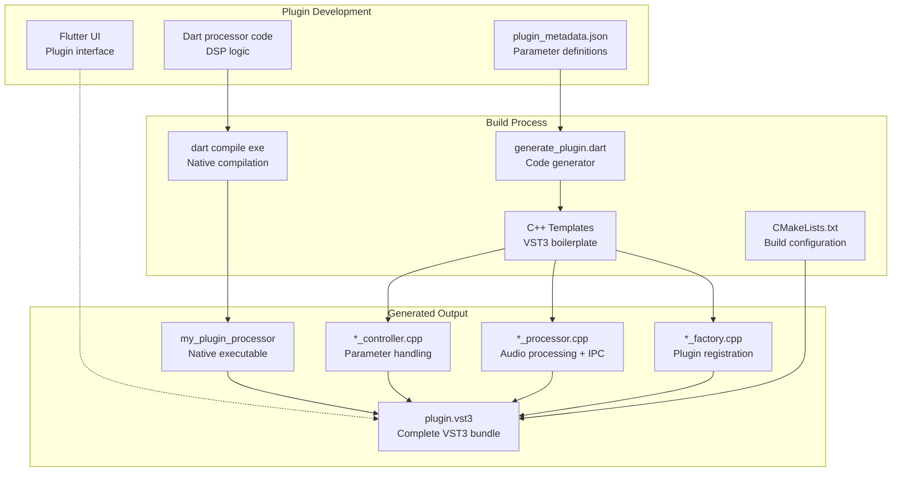
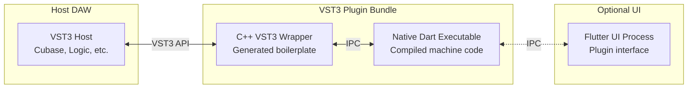

# dart_vst3_bridge

A Dart package that enables **pure Dart VST3 plugin development with Flutter UIs**. This bridge automatically generates all VST3 C++ boilerplate from JSON metadata, requiring zero C++ knowledge.

## VST3 Plugin Architecture with Native Dart Executable

The toolkit uses a unique architecture where Dart code is compiled to **native machine code executables** that communicate with the VST3 wrapper via IPC (Inter-Process Communication). This provides true native performance without requiring the Dart runtime in the DAW.



## Native Executable Implementation



## Core Concept

**Write Dart, get VST3.** Define your plugin parameters in JSON, implement audio processing in Dart, design your UI in Flutter, and the bridge generates all VST3 C++ code automatically. Your Dart code is compiled to native machine code for optimal performance.

## How It Works

1. **Define plugin metadata** in `plugin_metadata.json`:
   ```json
   {
     "pluginName": "Flutter Reverb",
     "vendor": "Your Company", 
     "parameters": [
       {
         "id": 1000,
         "name": "room_size",
         "defaultValue": 0.5,
         "units": "%"
       }
     ]
   }
   ```

2. **Implement audio processing** in Dart:
   ```dart
   void process(Float32List input, Float32List output) {
     // Pure Dart DSP processing - compiled to native code
   }
   ```

3. **Build with CMake** (automatically compiles Dart to native):
   ```cmake
   add_dart_vst3_plugin(my_plugin plugin_metadata.json)
   ```

4. **Result**: Complete VST3 plugin with native Dart executable, C++ wrapper, and optional Flutter UI.

## Features

- **🚀 Zero C++ Required**: Write only Dart and JSON
- **🎨 Flutter UIs**: Rich, modern plugin interfaces  
- **⚡ Code Generation**: Automatic VST3 C++ from metadata
- **📦 Complete VST3**: Proper SDK compliance and bundling
- **🔧 Cross-Platform**: macOS, Windows, Linux support
- **🛡️ Type Safe**: Generated C++ matches Dart exactly

## Quick Start

1. **Create plugin directory**:
   ```bash
   mkdir my_plugin && cd my_plugin
   ```

2. **Add metadata** (`plugin_metadata.json`):
   ```json
   {
     "pluginName": "My Plugin",
     "vendor": "Your Company",
     "version": "1.0.0",
     "category": "Effect",
     "bundleIdentifier": "com.yourcompany.myplugin",
     "companyWeb": "https://yourcompany.com",
     "companyEmail": "info@yourcompany.com",
     "parameters": []
   }
   ```

3. **Add CMake** (`CMakeLists.txt`):
   ```cmake
   cmake_minimum_required(VERSION 3.20)
   project(my_plugin)
   
   include(../../dart_vst3_bridge/native/cmake/VST3Bridge.cmake)
   add_dart_vst3_plugin(my_plugin plugin_metadata.json)
   ```

4. **Build**:
   ```bash
   mkdir build && cd build && cmake .. && make
   ```

## Project Structure

```
my_plugin/
├── plugin_metadata.json         ← Plugin definition
├── lib/
│   ├── src/
│   │   └── my_plugin_processor.dart  ← Dart DSP logic
│   └── my_plugin.dart
├── CMakeLists.txt               ← Build configuration
└── build/
    ├── generated/               ← Auto-generated C++
    │   ├── my_plugin_controller.cpp
    │   ├── my_plugin_processor.cpp
    │   └── my_plugin_factory.cpp
    └── VST3/Release/my_plugin.vst3  ← Final VST3 bundle
```

This package is part of the broader VST3 toolkit that also includes `dart_vst_host` (for loading VST3s) and `dart_vst_graph` (for audio routing).