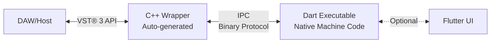

# flutter_vst3

Build VST® 3 plugins with **Flutter UI** and **pure Dart audio processing**. Zero C++ knowledge required.

*VST® is a trademark of Steinberg Media Technologies GmbH, registered in Europe and other countries.*

## What This Package Does

flutter_vst3 is a complete framework that:
- **Auto-generates** all VST® 3 C++ boilerplate from Dart metadata
- **Compiles** Dart DSP code to native executables for real-time performance  
- **Enables** Flutter UIs for rich, modern plugin interfaces
- **Handles** all VST® 3 SDK complexity automatically

## Architecture



The framework compiles your Dart code to a **native executable** (not AOT, not JIT - pure machine code) that runs as a separate process and communicates with the VST® 3 wrapper via high-performance IPC.

## Quick Start

### 1. Create Your Plugin Structure

```bash
my_echo/
├── plugin_metadata.json      # Plugin definition
├── lib/
│   ├── my_echo_processor_exe.dart  # Main executable entry
│   └── src/
│       ├── echo_processor.dart     # DSP implementation  
│       └── echo_parameters.dart    # Parameter handling
└── CMakeLists.txt
```

### 2. Define Metadata (`plugin_metadata.json`)

```json
{
  "pluginName": "My Echo",
  "vendor": "Your Company",
  "version": "1.0.0",
  "category": "Fx|Delay",
  "bundleIdentifier": "com.yourcompany.echo",
  "companyWeb": "https://yoursite.com",
  "companyEmail": "info@yoursite.com",
  "parameters": [
    {
      "id": 0,
      "name": "delayTime",
      "displayName": "Delay Time",
      "defaultValue": 0.5,
      "units": "ms"
    }
  ]
}
```

### 3. Implement DSP in Pure Dart

```dart
// echo_processor.dart
class EchoProcessor {
  void processStereo(List<double> inputL, List<double> inputR,
                     List<double> outputL, List<double> outputR,
                     EchoParameters params) {
    // Your DSP code here - pure Dart!
    for (int i = 0; i < inputL.length; i++) {
      outputL[i] = inputL[i] + delayBuffer[i] * params.feedback;
      outputR[i] = inputR[i] + delayBuffer[i] * params.feedback;
    }
  }
}
```

### 4. Create Executable Entry Point

```dart
// my_echo_processor_exe.dart
import 'dart:io';
import 'dart:typed_data';
import 'src/echo_processor.dart';

void main() async {
  final processor = EchoProcessor();
  
  await for (final bytes in stdin) {
    // Handle IPC commands: INIT, PROCESS, SET_PARAM
    // Process audio with your Dart DSP code
    // Send results back via stdout
  }
}
```

### 5. Build with CMake

```cmake
# CMakeLists.txt
cmake_minimum_required(VERSION 3.20)
project(my_echo)

include(../../flutter_vst3/native/cmake/VST3Bridge.cmake)
add_dart_vst3_plugin(my_echo plugin_metadata.json)
```

```bash
mkdir build && cd build
cmake .. && make
# Output: my_echo.vst3
```

## How It Works

1. **JSON → C++**: The `generate_plugin.dart` script reads your metadata and generates all VST® 3 C++ code
2. **Dart → Native**: CMake compiles your Dart processor to a native executable via `dart compile exe`
3. **Bundle Creation**: Everything is packaged into a standard VST® 3 bundle
4. **Runtime**: The C++ wrapper spawns your Dart executable and communicates via binary IPC protocol

## Features

✅ **Pure Dart DSP** - Write audio processing in familiar Dart syntax  
✅ **Native Performance** - Compiled to machine code, no runtime overhead  
✅ **Flutter UIs** - Create beautiful, reactive plugin interfaces  
✅ **Auto-Generated C++** - Never touch C++ code  
✅ **Cross-Platform** - macOS, Windows, Linux support  
✅ **VST® 3 Compliant** - Full compatibility with Steinberg VST® 3 SDK  

## IPC Protocol

The C++ wrapper and Dart executable communicate using a simple binary protocol:

| Command | ID | Data |
|---------|-----|------|
| INIT | 0x01 | Sample rate (float64) |
| PROCESS | 0x02 | Sample count + audio data |
| SET_PARAM | 0x03 | Param ID + value |
| TERMINATE | 0xFF | None |

## Project Structure After Build

```
my_echo/
├── build/
│   ├── generated/
│   │   ├── my_echo_controller.cpp    # Auto-generated
│   │   ├── my_echo_processor.cpp     # Auto-generated
│   │   └── my_echo_factory.cpp       # Auto-generated
│   ├── my_echo_processor              # Compiled Dart executable
│   └── VST3/
│       └── my_echo.vst3/             # Final plugin bundle
│           └── Contents/
│               ├── MacOS/
│               │   ├── my_echo        # VST® 3 dylib
│               │   └── my_echo_processor  # Dart exe
│               └── Info.plist
```

## Requirements

- Dart SDK 3.0+
- Flutter SDK 3.0+ (for UI components)
- CMake 3.20+
- Steinberg VST® 3 SDK (auto-downloaded by setup.sh)
- C++17 compiler

## Related Packages

- `dart_vst_host` - Load and control VST® 3 plugins from Dart
- `dart_vst_graph` - Audio routing and mixing for VST® plugins

## Legal Notice

This project is not affiliated with, endorsed by, or sponsored by Steinberg Media Technologies GmbH. 
VST® is a trademark of Steinberg Media Technologies GmbH, registered in Europe and other countries.

The flutter_vst3 framework is an independent implementation that interfaces with the Steinberg VST® 3 SDK
under the terms of the VST® 3 SDK License Agreement. Users of this framework must comply with the 
Steinberg VST® 3 SDK License Agreement when distributing VST® 3 plugins.

For more information about VST® 3 licensing, visit:
https://steinbergmedia.github.io/vst3_dev_portal/pages/VST+3+Licensing/Index.html

## License

See LICENSE file in the repository root.